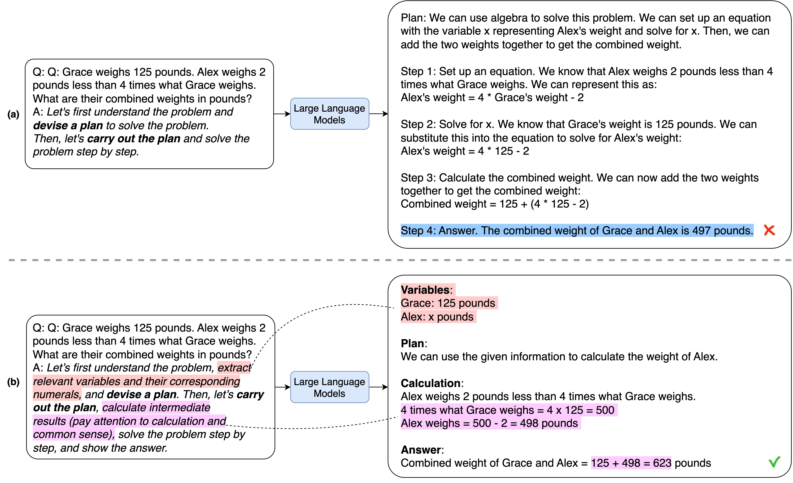
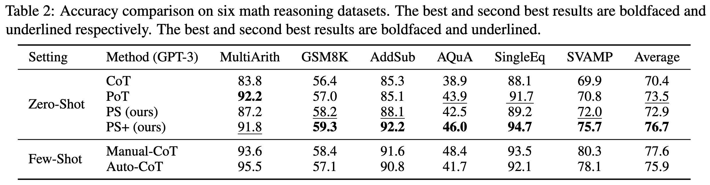

#  : Plan-and-Solve-Prompting

Code for our ACL 2023 Paper "[Plan-and-Solve Prompting: Improving Zero-Shot Chain-of-Thought Reasoning by Large Language Models](https://arxiv.org/abs/2305.04091)".

<!--  -->
<!-- <a href="https://hits.seeyoufarm.com"></a> -->



## :robot: Run Plan-and-Solve-Prompting
Set an api-key of OpenAI API in the file ```apikeys.json```
```shell
python main.py --prompt_id 201 \
--dataset SVAMP \
--engine text-davinci-003 \
--learning_type zero_shot
```

## :robot: Run Plan-and-Solve-Prompting with threads
Set 8 different api-keys of OpenAI API in the file ```apikeys.json```
```shell
python main_threads.py --prompt_id 201 \
--dataset SVAMP \
--engine text-davinci-003 \
--learning_type zero_shot
```



## :cook: Prompts
<table align="center">
<tr>
<th>Prompt_ID</th>
<th>Type</th>
<th>Trigger Sentence</th>
</tr>
<tr align="center">
<td>101</td>
<td>CoT</td>
<td align="left">Let's think step by step.</td>
</tr>
<tr align="center">
<td>201</td>
<td>PS</td>
<td align="left">Let's first understand the problem and devise a plan to solve the problem. Then, let's carry out the plan to solve the problem step by step.</td>
</tr>
<tr align="center">
<td>301</td>
<td>PS+</td>
<td align="left">Let's first understand the problem, extract relevant variables and their corresponding numerals, and devise a plan. Then, let's carry out the plan, calculate intermediate variables (pay attention to correct numeral calculation and commonsense), solve the problem step by step, and show the answer.</td>
</tr>
<tr align="center">
<td>302</td>
<td>PS+</td>
<td align="left">Let's first understand the problem, extract relevant variables and their corresponding numerals, and devise a complete plan. Then, let's carry out the plan, calculate intermediate variables (pay attention to correct numerical calculation and commonsense), solve the problem step by step, and show the answer.</td>
</tr>
<tr align="center">
<td>303</td>
<td>PS+</td>
<td align="left">Let's devise a plan and solve the problem step by step.</td>
</tr>
<tr align="center">
<td>304</td>
<td>PS+</td>
<td align="left">Let's first understand the problem and devise a complete plan. Then, let's carry out the plan and reason problem step by step. Every step answer the subquestion, "does the person flip and what is the coin's current state?". According to the coin's last state, give the final answer (pay attention to every flip and the coin’s turning state).</td>
</tr>
<tr align="center">
<td>305</td>
<td>PS+</td>
<td align="left">Let's first understand the problem, extract relevant variables and  their corresponding numerals, and make a complete plan. Then, let's carry out the plan, calculate intermediate variables (pay attention to correct numerical calculation and commonsense), solve the problem step by step, and show the answer.</td>
</tr>
<tr align="center">
<td>306</td>
<td>PS+</td>
<td align="left">Let's first prepare relevant information and make a plan. Then, let's answer the question step by step (pay attention to commonsense and logical coherence).</td>
</tr>
<tr align="center">
<td>307</td>
<td>PS+</td>
<td align="left">Let's first understand the problem, extract relevant variables and their corresponding numerals, and make and devise a complete plan. Then, let's carry out the plan, calculate intermediate variables (pay attention to correct numerical calculation and commonsense), solve the problem step by step, and show the answer.</td>
</tr>
</table>

## :star: Star History

[](https://star-history.com/#AGI-Edgerunners/Plan-and-Solve-Prompting&Date)

## :smile_cat: Cite

If you find **Plan-and-Solve-Prompting** useful for your research and applications, please kindly cite using this BibTeX:

```latex
@misc{wang2023planandsolve,
    title={Plan-and-Solve Prompting: Improving Zero-Shot Chain-of-Thought Reasoning by Large Language Models},
    author={Lei Wang and Wanyu Xu and Yihuai Lan and Zhiqiang Hu and Yunshi Lan and Roy Ka-Wei Lee and Ee-Peng Lim},
    year={2023},
    eprint={2305.04091},
    archivePrefix={arXiv},
    primaryClass={cs.CL}
}
```


